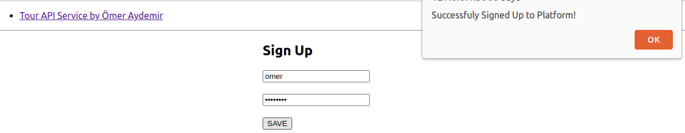
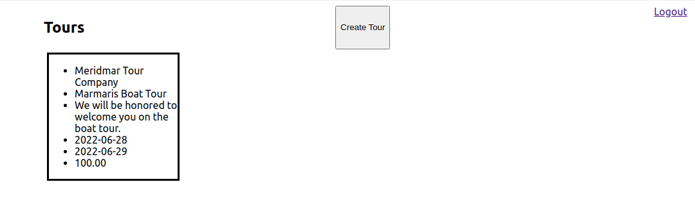

# Contents
* [About](#about)
* [Installation](#installation)
* [Tools and Technologies](#tools-and-technologies)
* [Main Features](#main-features)


# About

This sample API service, built on Django and React, is for managing tour reservations. It allows you to create users, create or edit tours.

## Tools and Technologies

* Django for back-end
* React for front-end
* Django JWT for authentication
* Django Modal-View for SQL integration

## Installation

Use the package manager [docker](https://docs.docker.com/engine/install) to install:

```bash
docker compose up
```

## Main Features


### Sign Up



### Create Tour 


### View Tours




## License
[GNU 3.0](https://github.com/omeraydemirr/tour-api/blob/c2638bb33e018fab441d078f2a95d4baab905b64/LICENSE)
