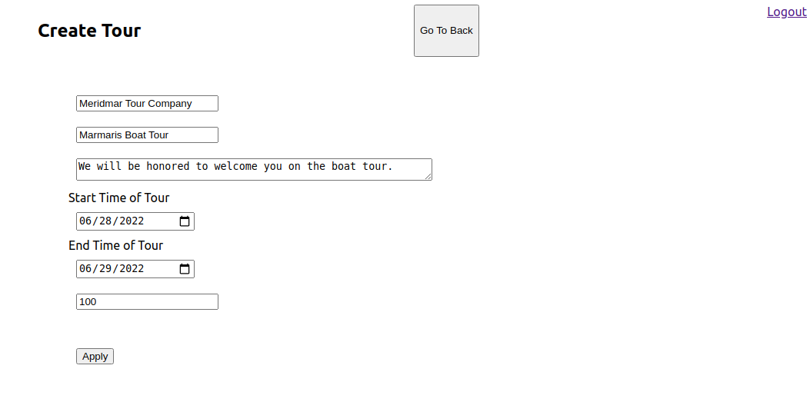

# Contents
* [About](#about)
* [Installation](#installation)
* [Tools and Technologies](#tools-and-technologies)
* [Main Features](#main-features)


# About

This sample API service, built on Django and React, is for managing tour operators. It allows you to create users, create or edit tours.

## Tools and Technologies

* Django for back-end
* React for front-end
* Django JWT for authentication
* Django Modal-View for SQL integration

## Installation

Use the package manager [docker](https://docs.docker.com/engine/install) to install foobar.

```bash
docker compose up
```

## Main Features


### Sign Up


### Create Tour 



### View Tours


## Contributing
Pull requests are welcome. For major changes, please open an issue first to discuss what you would like to change.

Please make sure to update tests as appropriate.

## License
[GNU 3.0](https://github.com/omercanaydemir/driver-upgrade/blob/69707a7d86dfe726f174ddd304af5a6daa102dd0/LICENSE)